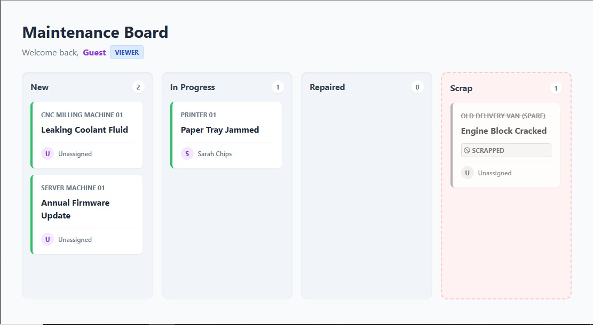
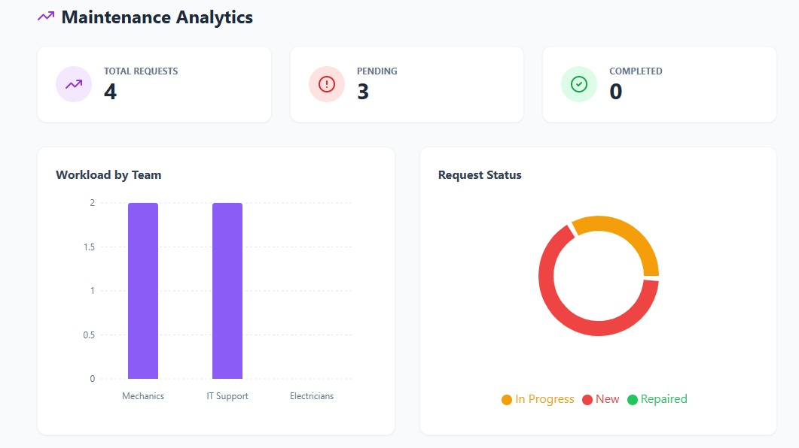

# ⚙️ GearGuard - Smart Maintenance Management System

> **Hackathon Project:** streamlining industrial equipment maintenance with real-time tracking, role-based workflows, and preventive scheduling.

 

## 🚀 The Problem
In manufacturing and IT, equipment downtime costs money. Tracking repairs via spreadsheets or paper is slow and error-prone. **GearGuard** centralizes this process, allowing teams to:
1.  Report issues instantly.
2.  Track repair progress visually.
3.  Schedule preventive maintenance to stop breakdowns before they happen.

## ✨ Key Features

* **🎨 Interactive Kanban Board:** Drag-and-drop tickets between *New*, *In Progress*, *Repaired*, and *Scrap*.
* **🔐 Role-Based Access Control (RBAC):**
    * **Technicians:** View/Update their assigned tasks.
    * **Managers:** View Analytics, assign tasks, and oversee the board.
    * **Admins:** Full system control.
* **📅 Preventive Calendar:** Visual schedule for upcoming maintenance checks.
* **📊 Analytics Dashboard:** Real-time charts showing workload distribution and repair status (Managers only).
* **📦 Asset Management:** Searchable list of all equipment and their health status.

## 🛠️ Tech Stack

**Frontend:**
* React.js (Vite)
* Tailwind CSS (Styling)
* Lucide React (Icons)
* Recharts (Data Visualization)
* React Router DOM (Navigation & Protected Routes)

**Backend:**
* Node.js & Express
* Sequelize ORM
* SQLite (Database)

---

## ⚡ Getting Started

Follow these steps to set up the project locally.

### 1. Clone the Repository
```bash
git clone https://github.com/satvikp-coder/Odoo.git
cd Odoo
```

### 2. Backend Setup

The backend runs on port `3000` and uses MySQL.

```bash
cd backend
npm install

# Initialize the Database with dummy data (CRITICAL STEP)
node seed.js 
# Note: The above command will delete previous database entries.

# Start the server
npm start

```

*You should see: `Server running on port 3000`*

### 3. Frontend Setup

Open a new terminal window.

```bash
cd frontend
npm install

# Start the React Dev Server
npm run dev

```

*Open the link shown (usually `http://localhost:5173`) in your browser.*

---

## 🔑 Demo Credentials (Login)

Use these accounts to test different permission levels:

| Role | Username | Password | Access Level |
| --- | --- | --- | --- |
| **Manager** | `Mike Wrench` | `1234` | Full Dashboard, Analytics, Kanban |
| **Technician** | `John Grease` | `1234` | Kanban, Request Updates |
| **Admin** | `Admin` | `1234` | Full System Access |

---

## 📸 Screenshots

### 1. The Kanban Board

*Visual tracking of maintenance requests.*


### 2. Analytics Dashboard

*Breakdown of request status and team workload.*


---
## Credits

Made with ❤️ by
1. Vansh Shah
2. Satvik Patel
3. Tanish Shah
4. Parth Mandalia


